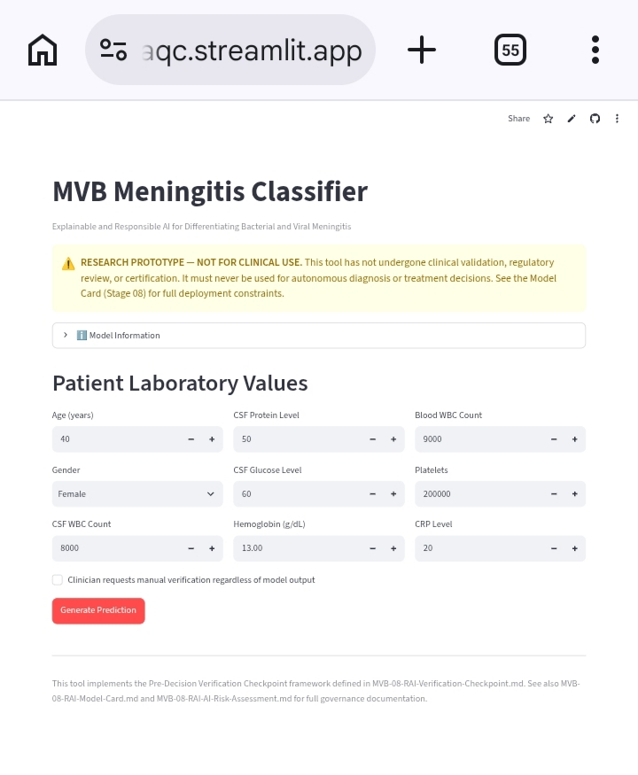
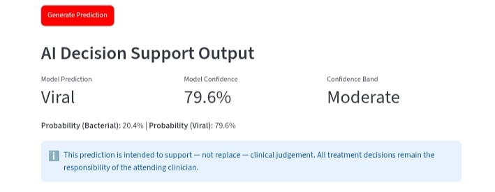
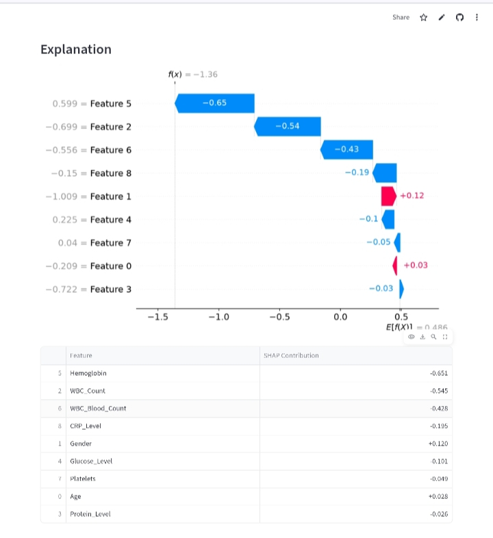
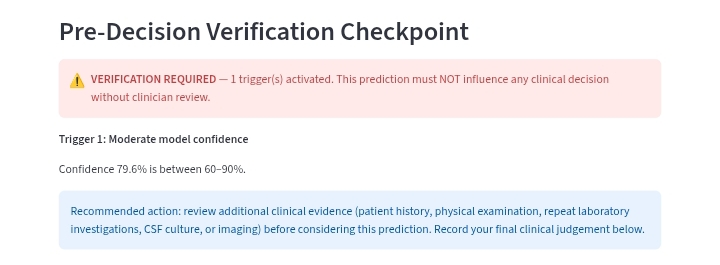

# P001-MVB — Explainable and Responsible AI for Differentiating Bacterial and Viral Meningitis

A Clinical Decision Support System | 3MTT DeepTech Cohort 2 — DS/ML Mentorship Programme

**Author:** Abubakar Amidu
**Project Code:** P001-MVB (Case Study 001 in a planned Responsible AI portfolio series)

⚠️ **RESEARCH PROTOTYPE — NOT FOR CLINICAL USE.** This project has not undergone clinical validation, regulatory review, or certification. See [Limitations](#limitations) below.

---

## Live Resources

### 🚀 Live Streamlit Application

https://p001-mvb-iq6ziqmh6yr9tbdamggaqc.streamlit.app/

**Launch the deployed application to explore:**

- Interactive clinical decision support
- Logistic Regression (Restricted Feature Set) prediction
- SHAP feature-level explanations
- Pre-Decision Verification Checkpoint (PDVC)
- Confidence scoring
- Audit log generation
- Responsible AI governance safeguards

---

### 🐙 GitHub Repository

https://github.com/Abamid/P001-MVB

Complete source code, notebooks, documentation, governance artefacts, and deployment files.

---

### 📊 Presentation

The complete presentation for this project is available below.

📄 **Presentation (PDF)**

[Download the P001-MVB Presentation](11_MVB_Presentation/P001-MVB_Presentation.pdf)

---

## Application Preview

The following screenshots demonstrate the deployed Streamlit application and its Responsible AI workflow.

### Home Screen



---

### AI Decision Support Output



---

### SHAP Explainability



---

### Pre-Decision Verification Checkpoint (PDVC)



---

These screenshots illustrate the complete Explainable and Responsible AI workflow implemented within the deployed Streamlit application—from patient data entry and model prediction through explainability and mandatory governance verification.

---

## Overview

Meningitis is a medical emergency where rapid, accurate diagnosis directly affects patient outcomes. Bacterial meningitis progresses quickly and can be fatal without prompt treatment; viral meningitis is typically self-limiting. This project builds a machine learning classifier to differentiate bacterial from viral meningitis using cerebrospinal fluid (CSF) and blood laboratory values — paired with a Responsible AI governance framework ensuring the model supports, rather than replaces, clinical judgment.

The governance approach is informed by a real-world AI deployment failure encountered during a separate 10-state education needs assessment project, where an AI-generated recommendation was later found incorrect upon verification with ground-truth sources. That experience motivated the **Pre-Decision Verification Checkpoint** — a structured framework, implemented here as working software, that flags predictions for mandatory human review under specific, evidence-based conditions.

---

## Why This Project Is Different

Many healthcare AI projects stop after producing an accurate prediction.

While predictive performance is important, real-world AI adoption also depends on **transparency, trust, governance, and human oversight**.

P001-MVB was intentionally designed to move beyond prediction by integrating Responsible AI principles directly into the deployed clinical decision-support application.

The project combines four complementary components:

- **Explainable Machine Learning** using Logistic Regression
- **SHAP feature-level explanations** for every prediction
- **Responsible AI governance** through a Model Card and AI Risk Assessment
- **Pre-Decision Verification Checkpoint (PDVC)** requiring clinician verification whenever predefined governance conditions are activated

Rather than replacing clinicians, the system supports clinical decision-making by ensuring that higher-risk predictions receive structured human verification before influencing patient care.

### Key Innovation

The primary innovation of this project is the **Pre-Decision Verification Checkpoint (PDVC).**

Instead of treating Responsible AI as documentation produced after model development, P001-MVB embeds governance directly into the prediction workflow.

The PDVC:

- Detects higher-risk predictions.
- Evaluates predefined governance triggers.
- Requires mandatory clinician verification before any prediction can influence a clinical decision.
- Promotes transparency through Explainable AI.
- Reduces automation bias.
- Reinforces clinician authority and accountability.

This transforms Responsible AI from a static governance document into an operational safeguard implemented within a working AI application.

> **Project Philosophy:**  
> **Prediction → Explanation → Verification → Clinical Decision**  
> AI supports clinicians; it does **not** replace them.

---

## Key Features

P001-MVB delivers an end-to-end Responsible AI clinical decision-support system featuring:

- 🧠 **Explainable Machine Learning** using Logistic Regression
- 🔍 **SHAP feature-level explanations** for every prediction
- 🛡️ **Responsible AI Governance** through a Model Card and AI Risk Assessment
- ✅ **Pre-Decision Verification Checkpoint (PDVC)** for mandatory clinician review when governance triggers are activated
- 👨‍⚕️ **Human-in-the-Loop Decision Support** that reinforces clinician authority rather than replacing it
- 📊 **Confidence scoring** to communicate prediction certainty
- 📝 **Audit log generation** supporting accountability and traceability
- 🌐 **Interactive Streamlit deployment** demonstrating the complete workflow
- 📚 **Comprehensive documentation** covering the full machine learning lifecycle from proposal through deployment

---

## Objectives

1. Build a classifier differentiating bacterial from viral meningitis using CSF and blood laboratory features.
2. Prioritize recall (sensitivity) for bacterial meningitis, since missed cases carry the greatest clinical risk.
3. Apply SHAP explainability so predictions are interpretable rather than a black box.
4. Design and implement a Pre-Decision Verification Checkpoint defining when clinician review is mandatory.
5. Produce a Model Card and AI Risk Assessment documenting intended use, limitations, and prohibited uses.
6. Deploy an interactive Streamlit application demonstrating the full pipeline end to end.

---

## Dataset

**Source:** [Meningitis Classification (Kaggle, ChanTest)](https://www.kaggle.com/)
**Records:** 1,200 original → 1,133 after cleaning (67 records with an "Unknown" diagnosis excluded)
**Target:** Bacterial (595, 52.5%) vs. Viral (538, 47.5%)
**Features used:** Age, Gender, WBC_Count, Protein_Level, Glucose_Level, Hemoglobin, WBC_Blood_Count, Platelets, CRP_Level

**Important caveat:** Analysis across Stages 01–03 found this dataset shows separability characteristics well beyond real-world clinical data (e.g., several individual lab markers alone achieve 86–94% classification accuracy — far higher than any single marker would in practice). The dataset is treated throughout this project as **clinically-inspired but not clinically-calibrated**, and this is reflected explicitly in the Model Card's limitations. See `MVB-01-schema-notes.md` and `MVB-03-eda-notes.md` for full detail.

---

## Technology Stack

- Python
- Streamlit
- Scikit-learn
- SHAP
- Pandas
- NumPy
- Matplotlib
- Jupyter Notebook
- Git & GitHub
- Google Colab

---

## Project Structure

```text
P001-MVB/
├── README.md
├── LICENSE
├── requirements.txt
├── .gitignore
│
├── 00_MVB_Proposal/                   Project proposal and planning
├── 01_MVB_Data-Acquisition/           Data acquisition and dataset profiling
├── 02_MVB_Data-Preparation/           Data cleaning, validation, preprocessing
├── 03_MVB_EDA/                        Exploratory data analysis
├── 04_MVB_Feature-Engineering/        Feature engineering and feature selection
├── 05_MVB_Model-Training/             Machine learning model development
├── 06_MVB_Evaluation/                 Model evaluation and selection
├── 07_MVB_Explainability/             SHAP explainability analysis
├── 08_MVB_Responsible-AI-Governance/  Model Card, AI Risk Assessment, PDVC
├── 09_MVB_Deployment/
│   └── 09_MVB_streamlit-app/          Streamlit application source code
├── 10_MVB_Documentation/              Executive summary, architecture, figures
├── 11_MVB_Presentation/               Presentation slides and supporting materials
└── 99_MVB_Journal/                    Development journal
```

Each stage folder contains the corresponding notebook, supporting documentation, generated outputs, and project artefacts for that phase of development. Together, they document the complete machine learning lifecycle from project conception through deployment.

> **Repository Status:** P001-MVB represents a complete end-to-end Explainable and Responsible AI project. Additional documentation, presentation materials, and future validation studies will continue to be added as the project evolves.

---

## Methodology Summary

| Stage | Summary |
|---|---|
| 01 — Acquisition | Profiled raw dataset; no missing values or duplicates |
| 02 — Preparation | Removed 67 "Unknown"-diagnosis records; documented Age>100 subgroup as a limitation |
| 03 — EDA | Found `Pathogen_Present` is a 94%-match near-proxy for the target; found unusually strong single-feature separability |
| 04 — Feature Engineering | Built two feature sets: Full (with `Pathogen_Present`) and Restricted (without) |
| 05 — Model Training | Trained Logistic Regression, Random Forest, XGBoost on both feature sets (6 models total) |
| 06 — Evaluation | Selected model by **Bacterial recall**, not aggregate accuracy — Logistic Regression outperformed tree-based models on this metric despite lower ROC-AUC |
| 07 — Explainability | SHAP confirmed the model relies on clinically plausible markers, in clinically expected directions |
| 08 — Governance | Produced Model Card, AI Risk Assessment, and Pre-Decision Verification Checkpoint |
| 09 — Deployment | Built a Streamlit app implementing the model, SHAP explanations, and PDVC as live logic |

---

## Model Performance

**Final Selected Model**

**Logistic Regression — Restricted Feature Set (Feature Set B)**

The final deployment model was selected after evaluating **six machine learning models** across two feature sets.

Unlike conventional machine learning projects that primarily optimise overall accuracy, P001-MVB prioritised **Bacterial Recall** because failing to identify bacterial meningitis presents the greatest clinical risk.

### Performance Summary

| Metric | Value |
|---------|------:|
| Accuracy | **93.4%** |
| Bacterial Recall | **95.8%** |
| Bacterial Precision | **91.9%** |
| False Negatives | **5 / 119** |
| False Positives | **10 / 108** |

### Why This Model Was Selected

The Logistic Regression model trained on the Restricted Feature Set was selected because it achieved the best overall balance between:

- High Bacterial Recall (patient safety priority)
- Strong predictive performance
- Clinical interpretability
- Explainable AI compatibility through SHAP
- Responsible AI deployment requirements

Although Random Forest and XGBoost achieved competitive performance, Logistic Regression aligned more closely with the project's objective of producing a transparent and clinically interpretable decision-support system.

The Restricted Feature Set was also preferred because it excludes **Pathogen_Present**, a variable identified during exploratory analysis as a near-proxy for the target diagnosis. Removing this feature reduced the risk of data leakage while maintaining excellent predictive performance.

Overall, the selected model reflects a deliberate balance between predictive performance, transparency, robustness, and Responsible AI principles rather than simply maximising benchmark metrics.

---

## Explainability

Interpretability is a central design principle of P001-MVB.

Rather than functioning as a "black-box" prediction model, the deployed application uses **SHAP (SHapley Additive exPlanations)** to provide transparent, feature-level explanations for every prediction generated by the Logistic Regression model.

### Explainability Features

The application provides:

- Global feature importance analysis.
- Local (patient-specific) feature contributions.
- SHAP waterfall visualisations for individual predictions.
- Ranked feature contribution tables.
- Clinically interpretable explanations supporting clinician review.

### Why SHAP?

SHAP enables clinicians to understand **why** a prediction was made rather than simply accepting the model's output.

This improves:

- Transparency
- Trust
- Clinical interpretability
- Human oversight
- Responsible AI adoption

Global SHAP analysis confirmed that the model primarily relies on clinically plausible laboratory markers—including Hemoglobin, CRP, WBC counts, Platelets, and Glucose—in directions that are consistent with established clinical understanding of bacterial and viral meningitis.

In addition, SHAP explanations were generated for all five false-negative evaluation cases to investigate model behaviour and support governance analysis.

Rather than serving as a visualisation tool alone, SHAP forms an integral component of the project's Explainable AI and Responsible AI framework.

---

## Responsible AI Governance

Responsible AI is not presented as an add-on to this project—it is embedded throughout the machine learning lifecycle and the deployed application.

P001-MVB was designed to demonstrate that high-performing AI systems should also be **transparent, accountable, explainable, and governed** before they are trusted to support real-world decisions.

### Governance Framework

The project implements three complementary Responsible AI artefacts:

### 📄 Model Card

The Model Card documents:

- Intended use
- Intended users
- Training data characteristics
- Performance metrics
- Known limitations
- Ethical considerations
- Prohibited uses
- Deployment constraints

---

### ⚠️ AI Risk Assessment

The AI Risk Assessment identifies and evaluates potential risks associated with deploying the model, including:

- False-negative clinical risk
- Automation bias
- Overconfidence in AI predictions
- Out-of-distribution inputs
- Dataset limitations
- Human oversight requirements

The assessment also defines mitigation strategies that reduce these risks during deployment.

---

### ✅ Pre-Decision Verification Checkpoint (PDVC)

The **Pre-Decision Verification Checkpoint (PDVC)** is the principal innovation introduced by P001-MVB.

Rather than allowing predictions to directly influence clinical decisions, the PDVC evaluates predefined governance conditions before a prediction can be considered.

When one or more governance triggers are activated, the application requires mandatory clinician verification before the prediction may inform patient management.

The deployed prototype currently implements:

- Confidence-based verification triggers
- Clinician-requested manual verification
- Structured verification guidance
- Prediction audit logging
- Human-in-the-loop decision support

This approach reduces automation bias while reinforcing clinician authority and accountability.

---

### Responsible AI in Practice

Unlike many AI projects where governance exists only as documentation, P001-MVB operationalises Responsible AI by embedding governance directly into the deployed application.

Every prediction follows the workflow:

**Prediction → SHAP Explanation → PDVC Evaluation → Clinician Verification (if required) → Clinical Decision**

This transforms Responsible AI from a static compliance exercise into an active operational safeguard supporting safer AI-assisted decision-making.

---

## Deployment

P001-MVB has been successfully deployed as an interactive **Streamlit Community Cloud** application, demonstrating the complete Explainable and Responsible AI workflow developed throughout this project.

### Live Application

🚀 **Streamlit App:**  
https://p001-mvb-iq6ziqmh6yr9tbdamggaqc.streamlit.app/

🐙 **GitHub Repository:**  
https://github.com/Abamid/P001-MVB

---

### Application Features

The deployed application implements:

- Logistic Regression (Restricted Feature Set) prediction model
- SHAP feature-level explanations for every prediction
- Confidence scoring (High / Moderate / Low)
- Pre-Decision Verification Checkpoint (PDVC)
- Responsible AI governance safeguards
- Human-in-the-loop decision support
- Prediction audit log generation
- Research prototype safety notice

---

### Responsible AI in Practice

Unlike many demonstration applications that only display predictions, the deployed prototype embeds governance directly into the prediction workflow.

Every prediction is accompanied by:

- Explainable AI using SHAP
- Confidence assessment
- Verification trigger evaluation
- Mandatory clinician review whenever PDVC conditions are activated
- Structured audit logging

This demonstrates how Responsible AI can become an operational component of a deployed AI system rather than remaining solely as documentation.

> **Note:** This application is intended exclusively for research, education, and demonstration purposes. It has not undergone clinical validation or regulatory approval and must never be used for autonomous medical decision-making.

---

## Project Resources

### 🚀 Live Application

https://p001-mvb-iq6ziqmh6yr9tbdamggaqc.streamlit.app/

---

### 🐙 GitHub Repository

https://github.com/Abamid/P001-MVB

---

### 📊 Presentation

**Placeholder:** Presentation PDF will be added after final submission.

---

### 📄 Documentation

**Placeholder:** Executive Summary and Architecture Documentation will be uploaded to the repository.

---

### 📱 QR Codes

**Placeholder:** GitHub and Streamlit QR codes will be added after final documentation is completed.

---

## Limitations

- Training data could not be confirmed as real clinical data — it is characterized throughout this project as clinically-inspired but not clinically-calibrated, and reported performance metrics should not be read as real-world clinical performance estimates.
- No external validation, hyperparameter tuning, or cross-validation was performed.
- The application prototype has no authentication, does not persist audit logs, and has one PDVC trigger (data quality validation) only partially implemented.
- This is a research and educational demonstration only. See the [Model Card](08_MVB_Responsible-AI-Governance/MVB-08-RAI-Model-Card.md) for the full deployment statement and prohibited uses.

---

## Future Roadmap

P001-MVB serves as a research prototype demonstrating Explainable and Responsible AI for clinical decision support. Several enhancements are planned for future iterations:

### Model Development

- Validate the model using representative real-world clinical datasets.
- Perform hyperparameter optimisation.
- Implement cross-validation and probability calibration.
- Evaluate additional explainable machine learning algorithms.

### Responsible AI

- Expand the Pre-Decision Verification Checkpoint (PDVC) with additional governance rules.
- Implement comprehensive audit logging and reporting.
- Add user authentication and role-based access control.
- Develop governance dashboards for monitoring AI system behaviour.

### Clinical Deployment

- Integrate with electronic health record (EHR) systems.
- Improve input validation and data quality assessment.
- Conduct prospective clinical evaluation.
- Explore regulatory readiness for real-world deployment.

### Research

- Extend the PDVC framework to additional high-impact healthcare AI applications.
- Investigate human-AI collaboration strategies in clinical decision support.
- Evaluate clinician trust and usability through user studies.

> These enhancements represent future research directions and are not implemented in the current prototype.

---

## Citation

If you reference or build upon this project, please cite it as:

```text
Amidu, A. (2026).
P001-MVB: Explainable and Responsible AI for Differentiating
Bacterial and Viral Meningitis — A Clinical Decision Support System.
GitHub Repository:
https://github.com/Abamid/P001-MVB
```

Please also acknowledge the 3MTT DeepTech Cohort 2 – Data Science / Machine Learning Mentorship Programme where appropriate.

---

## Acknowledgements

Developed as part of the 3MTT DeepTech Cohort 2 mentorship programme, under mentorship from Chukwukadibia Onyekwere.

---

## License

See [LICENSE](LICENSE).
